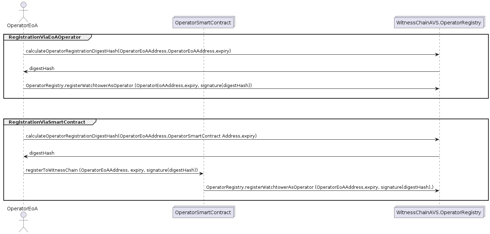

# Operator Registration

WitnessChain's OperatorRegistry has standardized on EIP-1271 to enable both External Operator Accounts (EOA) and Smart Contract Wallets (SCW) to register seamlessly. [EIP-1271](https://eips.ethereum.org/EIPS/eip-1271) is an Ethereum Improvement Proposal that defines a standard for verifying signatures from smart contracts, ensuring compatibility and security across different types of addresses. By adopting this standard, the OperatorRegistry allows EOAs to register directly using their private key signatures, while SCWs can utilize their smart contract logic to validate signatures. This approach ensures that both types of accounts can participate in the registration process, promoting inclusivity and interoperability within the blockchain ecosystem. This standardization also enhances the robustness of the registration process by providing a consistent and secure method for verifying signatures, regardless of whether they originate from an EOA or an SCW.

The below image depicts a sequence diagram outlining two methods for Operator Registration on the WitnessChain AVS. 

## Method 1: RegistrationViaEoAOperator (EoA Address is the operator)

1. calculateOperatorRegistrationDigestHash
    - The OperatorEoA (External Operator Account) initiates the process by calling the function `calculateOperatorRegistrationDigestHash`.
    - This function takes three parameters: <em>[OperatorEoAAddress, OperatorEoAAddress (itself), expiry]</em>.

2. Return digestHash
    - The function returns a `digestHash`, which is a unique hash generated based on the input parameters.

3. OperatorRegistry.registerWatchtowerAsOperator
    - The OperatorEoA then calls the `registerWatchtowerAsOperator` function on the OperatorRegistry contract.
    - This function call includes four parameters: <em>[OperatorEoAAddress, expiry, and the signature(digestHash)]</em> (the digest hash signed by the OperatorEoA).

4. Completion
    - The OperatorRegistry contract processes the registration, effectively registering the OperatorEoA as an operator.

## Method 2: RegistrationViaSmartContract (Smart Contract Wallet Address is the operator)

1. calculateOperatorRegistrationDigestHash
    - The OperatorEoAWallet initiates the registration by calling the `calculateOperatorRegistrationDigestHash` function.
    - This function takes three parameters: <em>[OperatorEoAAddress, OperatorSmartContractAddress, and an expiry]</em>.

2. Return digestHash
    - The function returns a `digestHash`, which is generated based on the input parameters.

3. registerToWitnessChain (<em>This can be different based on the operator's smart contract function signature</em>)
    -   The OperatorEoAWallet then calls the registerToWitnessChain function on the OperatorSmartContract, passing in three parameters: OperatorEoAAddress, expiry, and the signature(digestHash) (the digest hash signed by the OperatorEoAWallet).

4. OperatorRegistry.registerWatchtowerAsOperator
    - Internally, the registerToWitnessChain function of the OperatorSmartContract calls the `registerWatchtowerAsOperator` function on the OperatorRegistry contract.
    - The parameters passed are: <em>[OperatorEoAAddress, expiry, and signature(digestHash)]</em>.

5. Completion
    - The OperatorRegistry contract processes the registration, registering the OperatorSmartContract as an operator.

<!--
@startuml
actor       OperatorEoA       as OperatorEoA 
collections OperatorSmartContract as SCW
collections    WitnessChainAVS.OperatorRegistry              as WitnessChainAVS
group RegistrationViaEoAOperator
||20||
OperatorEoA-> WitnessChainAVS: calculateOperatorRegistrationDigestHash(OperatorEoAAddress,OperatorEoAAddress,expiry)
||20||
WitnessChainAVS-> OperatorEoA: digestHash
||20||
OperatorEoA -> WitnessChainAVS : OperatorRegistry.registerWatchtowerAsOperator (OperatorEoAAddress,expiry, signature(digestHash))
||20||
end

||45||
group RegistrationViaSmartContract
||20||
OperatorEoA-> WitnessChainAVS: calculateOperatorRegistrationDigestHash(OperatorEoAAddress,OperatorSmartContract Address,expiry)
||20||
WitnessChainAVS -> OperatorEoA: digestHash
||20||
OperatorEoA -> SCW :registerToWitnessChain (OperatorEoAAddress, expiry, signature(digestHash))
||20||
SCW -> WitnessChainAVS : OperatorRegistry.registerWatchtowerAsOperator (OperatorEoAAddress,expiry, signature(digestHash),)
||20||
end
@enduml
-->
